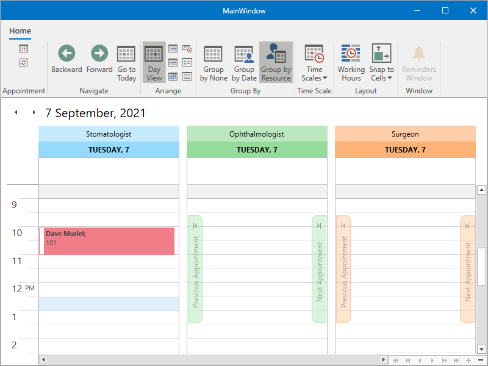

<!-- default badges list -->

<!-- default badges end -->
<!-- default file list 
*Files to look at*:

* [Doctor.cs](./CS/SimpleSchedulingExample/Doctor.cs) (VB: [Doctor.vb](./VB/SimpleSchedulingExample/Doctor.vb))
* [MainViewModel.cs](./CS/SimpleSchedulingExample/MainViewModel.cs) (VB: [MainViewModel.vb](./VB/SimpleSchedulingExample/MainViewModel.vb))
* [MainWindow.xaml](./CS/SimpleSchedulingExample/MainWindow.xaml) (VB: [MainWindow.xaml](./VB/SimpleSchedulingExample/MainWindow.xaml))
* [MainWindow.xaml.cs](./CS/SimpleSchedulingExample/MainWindow.xaml.cs) (VB: [MainWindow.xaml.vb](./VB/SimpleSchedulingExample/MainWindow.xaml.vb))
* [MedicalAppointment.cs](./CS/SimpleSchedulingExample/MedicalAppointment.cs) (VB: [MedicalAppointment.vb](./VB/SimpleSchedulingExample/MedicalAppointment.vb))
 default file list end -->
# Scheduler for WPF - How to create a basic scheduling application

<!--This example follows the <a href="http://help.devexpress.com/#WPF/CustomDocument114882">Getting Started</a> topic and demonstrates how to create a simple scheduling application using the new WPF Scheduler.-->

This example shows how to create a basic scheduling application with the [SchedulerControl](https://docs.devexpress.com/WPF/DevExpress.Xpf.Scheduling.SchedulerControl).

 

## Implementation Details

* To create a [POCO View Model](https://docs.devexpress.com/WPF/17352/mvvm-framework/viewmodels/runtime-generated-poco-viewmodels), use the [DevExpress MVVM Framework](https://docs.devexpress.com/WPF/15112/mvvm-framework). This is a Data Model that gives data for a scheduling application.

* The View Model uses the **MedicalAppointment** and **Doctor** class instances as collections of the **ObservableCollection** type collections.

* The scheduling application includes the [Ribbon](https://docs.devexpress.com/WPF/120132/controls-and-libraries/scheduler/visual-elements/ribbon).

* To bind to data, use the [DataSource.AppointmentsSource](https://docs.devexpress.com/WPF/DevExpress.Xpf.Scheduling.DataSource.AppointmentsSource) (for **MedicalAppointment** objects) and [DataSource.ResourcesSource](https://docs.devexpress.com/WPF/DevExpress.Xpf.Scheduling.DataSource.ResourcesSource) (for **Doctor** objects) properties.

* To specify [mappings](https://docs.devexpress.com/WPF/119493/controls-and-libraries/scheduler/data-binding/mappings), use the [DataSource.AppointmentMappings](https://docs.devexpress.com/WPF/DevExpress.Xpf.Scheduling.DataSource.AppointmentMappings) and [DataSource.ResourceMappings](https://docs.devexpress.com/WPF/DevExpress.Xpf.Scheduling.DataSource.ResourceMappings) properties.
## Files to Review

* [Doctor.cs](./CS/SimpleSchedulingExample/Doctor.cs) (VB: [Doctor.vb](./VB/SimpleSchedulingExample/Doctor.vb))
* [MainViewModel.cs](./CS/SimpleSchedulingExample/MainViewModel.cs) (VB: [MainViewModel.vb](./VB/SimpleSchedulingExample/MainViewModel.vb))
* [MainWindow.xaml](./CS/SimpleSchedulingExample/MainWindow.xaml) (VB: [MainWindow.xaml](./VB/SimpleSchedulingExample/MainWindow.xaml))
* [MainWindow.xaml.cs](./CS/SimpleSchedulingExample/MainWindow.xaml.cs) (VB: [MainWindow.xaml.vb](./VB/SimpleSchedulingExample/MainWindow.xaml.vb))
* [MedicalAppointment.cs](./CS/SimpleSchedulingExample/MedicalAppointment.cs) (VB: [MedicalAppointment.vb](./VB/SimpleSchedulingExample/MedicalAppointment.vb))

## Documentation

* [Create a Data Model](https://docs.devexpress.com/WPF/119796/controls-and-libraries/scheduler/getting-started/create-a-simple-scheduling-application#create-a-data-model)
* [Create a View Model](https://docs.devexpress.com/WPF/119796/controls-and-libraries/scheduler/getting-started/create-a-simple-scheduling-application#create-a-view-model)
* [Create Ribbon](https://docs.devexpress.com/WPF/119796/controls-and-libraries/scheduler/getting-started/create-a-simple-scheduling-application#create-ribbon)
* [Specify the Scheduler Settings](https://docs.devexpress.com/WPF/119796/controls-and-libraries/scheduler/getting-started/create-a-simple-scheduling-application#specify-the-scheduler-settings)
* [Bind to Data](https://docs.devexpress.com/WPF/119796/controls-and-libraries/scheduler/getting-started/create-a-simple-scheduling-application#bind-to-data)

## More Examples

* [How to: Bind Scheduler to Data using the Entity Framework Code First Approach](https://docs.devexpress.com/WPF/115305/controls-and-libraries/scheduler/examples/how-to-bind-scheduler-to-data-using-the-entity-framework-code-first-approach)
* [How to: Customize Editing and Recurrence Dialogs](https://docs.devexpress.com/WPF/115395/controls-and-libraries/scheduler/examples/how-to-customize-editing-and-recurrence-dialogs)
* [How to: Customize the In-Place Editor](https://docs.devexpress.com/WPF/115449/controls-and-libraries/scheduler/examples/how-to-customize-the-in-place-editor)

